# _SESF_

[](https://travis-ci.org/Genius-SexyBoy/SESF "build")
[](https://github.com/Genius-SexyBoy/SESF/releases/latest/ "release")
[](https://github.com/Genius-SexyBoy/SESF/issues "issues")

_SESF is a simple embeded software developing environment framework about stm32 Microcontroler. The goal is to make stm32 developing more simple and stupid!_

### The structure of _SESF_ is shown as follow:


### Directory tree

```
├── App
│   ├── app.mk
│   ├── Inc
│   └── Src
├── Component
│   ├── FreeRTOS
│   ├── lvgl
│   ├── Peripheral
│   └── port
├── Doc
│   └── Figures
├── Drivers
│   ├── BSP
│   ├── CMSIS
│   └── STM32F4xx_HAL_Driver
├── f429-lvgl-freertos.ioc
├── LICENSE
├── Makefile
├── project-style
├── README.md
├── startup_stm32f429xx.s
└── STM32F429ZITx_FLASH.ld
```
---


  - [Features](#Features)
  - [Supported devices](#Supported-devices)
  - [Dependence](#Dependence)
  - [Build the project](#Build-the-project)
  - [TODO](#TODO)


## Features
* **Portable building system**: Write a simple makefile so that you could porting many powerful open source library into your project
* **RTOS Support**: FreeRTOS inside
* **GUI Support**: LVGL inside
* **DSP Support**: CMSIS DSP Lib inside

## Supported devices
* STM32F429-Discovery

## Dependence
  - **Toolchain**
    - arm-none-eabi-gcc
    - arm-none-eabi-binutils
    - arm-none-eabi-gdb
    - arm-none-eabi-newlib
  - **Debuger Driver**
    - st-link or jlink
## Build the project
* clone
  ```bash
  git clone --recursive https://github.com/Genius-SexyBoy/SESF.git
  cd kiterf
  ```
* compile && flash(st-link)
  ```bash
  make -j4
  st-flash write ./build/<target-name>.bin 0x08000000
  ```

## TODO
* Add some docs to explain how to use this framework and what to do in you private project
* Add some script to auto generate and modify makefile if the source file have been changed
* Support all of STM32F4 Series Microcontrolers

## License

[](LICENSE)

* MIT License (It doesn't matter)

## Contributing


If you are pleased with the project, give me _Star_ rather than coffee and your code:)
